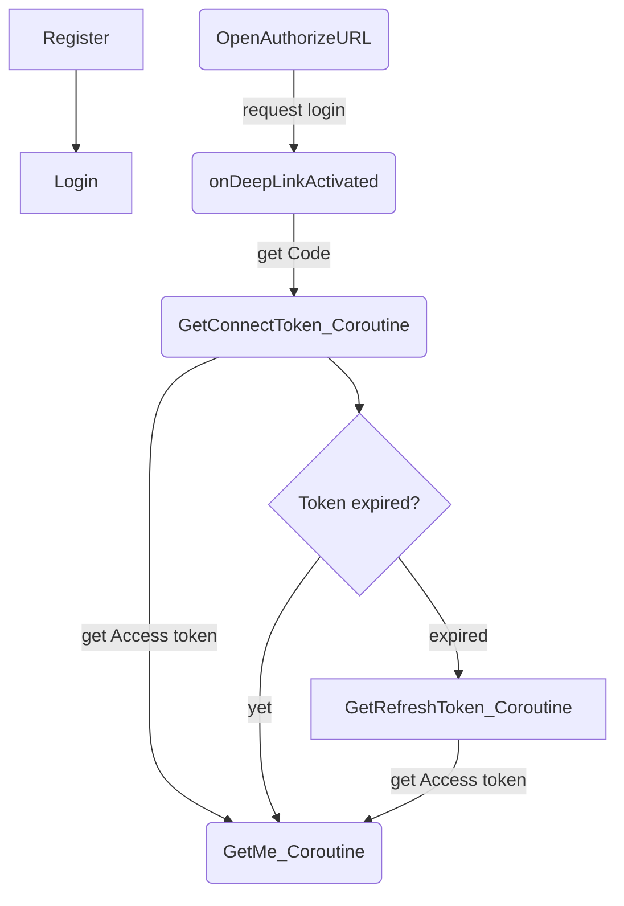
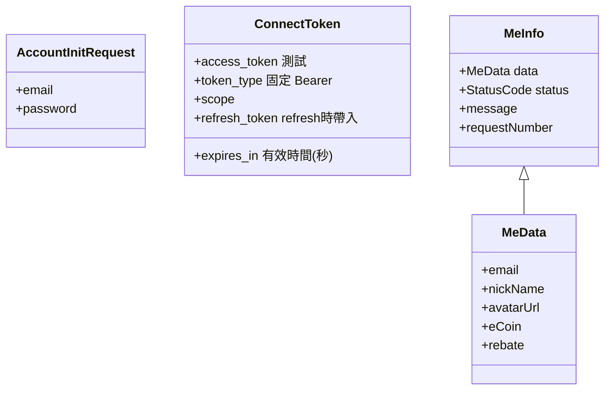

# 17dame Connect Tool for Unity
17dame connect tool: ConnectTool provides registration, login and Authorize, and obtains access_token to perform related functions.
## Table of Contents

- [Installation](#installation)
    - [Unity Package](#unity-package) 
- [Setting](#setting)
- [Flow](#operating)
- [ConnectTool function](#function) 
    - [SendRegisterData](#SendRegisterData)
    - [SendLoginData](#SendLoginData)
    - [OpenAuthorizeURL](#OpenAuthorizeURL)
    - [GetConnectToken_Coroutine](#GetConnectToken_Coroutine)
    - [GetRefreshToken_Coroutine](#GetRefreshToken_Coroutine)  
- [Model](#model)
 

## Installation

This library is distributed via Unity's built-in package manager. Required Unity 2022.3 or later.

### Unity Package
- Open Unity project
- Download and run .unitypackage file from the latest release
- 
## Setting
- Open File > Build Settings > Player Settings > Build
    Check the options of `Custom Main Manifest`
- Open \Assets\Plugins\Android, AndroidManifest.xml and add:
```xml
<intent-filter>
  <action android:name="android.intent.action.VIEW" />
  <category android:name="android.intent.category.DEFAULT" />
  <category android:name="android.intent.category.BROWSABLE" />
  <data android:scheme="{{ Get from redirect_uri's scheme }}" android:host="connectlink" />
</intent-filter>
```  
- redirect_uri : Set the name of the scene to be opened, for example `{{ Get from redirect_uri's scheme }}://connectlink?connectscene`


## Flow
Here is a simple flow chart:

 
Send Authorize to get access_token and get code. Please refer to ConnectSample to join Awake.
```csharp 
private void Awake()
    {
        if (Instance == null)
        {
            Instance = this;
            Application.deepLinkActivated += onDeepLinkActivated;
            if (!string.IsNullOrEmpty(Application.absoluteURL))
            {
                onDeepLinkActivated(Application.absoluteURL);
            } 
            DontDestroyOnLoad(gameObject);
        }
        else
        {
            Destroy(gameObject);
        }
    } 
```

## ConnectTool function
- Create `ConnectTool` and `ConnectBasic`, parameters must be filled in:
```csharp
_connectTool = new ConnectTool( 
  state,
  requestNumber,
  redirect_uri,
  RSAxmlStr
); 
_connectTool.connectBasic = new ConnectBasic()
{
    client_id = "",
    X_Developer_Id = "",
    client_secret = "",
    Game_id = "",
    referralCode = "",
};
``` 
- RSAxmlStr : Please convert RSA key to xml, because .NET 2 does not support rsa.ImportRSAPrivateKey. Refer this [online tool](https://raskeyconverter.azurewebsites.net/PemToXml?handler=ConvertXML)
- state : Please fill in that you want to verify,`state` will be passed back through redirect_uri.
- requestNumber :The request identification generated by game developer, It must be Universally Unique Identifier (UUID).
         
### SendRegisterData　
- Create ConnectTool.CreateAccountInitData object first; 
```csharp  
_connectTool.CreateAccountInitData(_email,_password);
```
- `email`,`Password` are required.
- Send ConnectTool.SendRegisterData().
- Return StatusCode check.
  
### SendLoginData　
- Create ConnectTool.CreateAccountInitData object first; 
```csharp  
_connectTool.CreateAccountInitData(_email,_password);
```
- `email`,`Password` are required.
- Send ConnectTool.SendLoginData().
- Return StatusCode check.

### OpenAuthorizeURL　 
- `connectBasic.client_id` is required. 
- Open host page to log in.
- After logs in, will get `code` from redirect_uri parameter.
```csharp  
private void onDeepLinkActivated(string url)
    {
        Uri codeUri = new Uri(url);
        string code = HttpUtility.ParseQueryString(codeUri.Query).Get("code"); 
        _connectTool.code = code;
 
        bool validScene = false;
        string sceneName = url.Split('?')[1];
        if (sceneName.Contains("connectscene"))
        {
            validScene = true;
        } 
        if (validScene) SceneManager.LoadScene("connectscene"); 
    }
```
Step 
1. Execute Authorize through ConnectTool.
2. Open Login page.
3. Retrieve code through onDeepLinkActivated.
4. Execute GetConnectToken_Coroutine to obtain access_token.
   
### GetConnectToken_Coroutine 
- `code` is required. 
- `code` can be obtained through ConnectTool settings or onDeepLinkActivated function.
- Return ConnectTokenModel 
 
### GetRefreshToken_Coroutine  
- `refresh_token` in ConnectTool can't be null.
- Return ConnectTokenModel 

### GetMe_Coroutine 
- `access_token` in ConnectTool can't be null. 
- Return MeInfo.
 

## Model 

     
 

 


